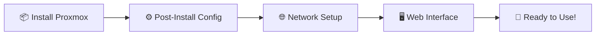

# Awesome Proxmox VE ⚡

  
  
  
  <h3>🌟 The Ultimate Collection of Proxmox VE Resources 🌟</h3>
  
  
  
  
  
  
  
  
<em>A comprehensive collection of <strong>AWESOME</strong> <a href="https://pve.proxmox.com">Proxmox VE</a> resources including documentation, tools, tutorials, and community contributions.</em>

  
  
⭐ <strong>Want to contribute?</strong> We welcome pull requests, suggestions, and additions! ⭐

  

---

## 📖 About This Collection

> 🚀 **Whether you're a beginner or an advanced user**, this curated list will help you make the most of your Proxmox Virtual Environment. From getting started guides to enterprise-grade tools, everything you need is here!

| 🎯 **Quick Navigation** |
|---|
| **[🚀 Getting Started](#-getting-started)** • **[🔧 API & SDKs](#-api--sdks)** • **[📚 Documentation](#-documentation--learning)** • **[📊 Monitoring](#-monitoring--analytics)** |
| **[💾 Backup](#-backup-solutions)** • **[🛠️ Tools](#-tools--utilities)** • **[📱 Mobile Apps](#-mobile-applications)** • **[🗣️ Community](#-community--support)** |

---

## 📋 Table of Contents

🗂️ <strong>Click to expand full table of contents</strong>

- [🚀 Getting Started](#-getting-started)
- [🔧 API & SDKs](#-api--sdks)
- [📚 Documentation & Learning](#-documentation--learning)
- [📝 Articles & Tutorials](#-articles--tutorials)
- [📊 Monitoring & Analytics](#-monitoring--analytics)
- [💾 Backup Solutions](#-backup-solutions)
- [🗄️ Storage Solutions](#-storage-solutions)
- [🛠️ Tools & Utilities](#-tools--utilities)
- [📱 Mobile Applications](#-mobile-applications)
- [🎥 Video Resources](#-video-resources)
- [🗣️ Community & Support](#-community--support)
- [🌟 Contributing](#-contributing)

---

## 🚀 Getting Started

  

### 📋 Essential Resources

| Resource | Description | Links |
|----------|-------------|--------|
| 📖 **Official Documentation** | Complete official documentation | [📚 Docs](https://pve.proxmox.com/pve-docs/) |
| 🌐 **Wiki** | Community-maintained wiki with examples | [🔗 Wiki](https://pve.proxmox.com) |
| 💻 **System Requirements** | Hardware requirements and compatibility | [📋 Requirements](https://pve.proxmox.com/pve-docs/chapter-pve-installation.html#system_requirements) |
| 🛠️ **Installation Guide** | Step-by-step installation instructions | [📝 Guide](https://pve.proxmox.com/pve-docs/chapter-pve-installation.html) |

### 🏃‍♂️ Quick Start Guides

- **[🎯 First Steps](https://pve.proxmox.com/pve-docs/chapter-sysadmin.html)** - Post-installation configuration
- **[🖥️ Web Interface](https://pve.proxmox.com/pve-docs/chapter-gui.html)** - Understanding the management interface
- **[🌐 Network Configuration](https://pve.proxmox.com/pve-docs/chapter-sysadmin.html#sysadmin_network_configuration)** - Setting up networking

---

## 🔧 API & SDKs

  

### 🌐 Official API

| Resource | Description |
|----------|-------------|
| 📚 **[Proxmox VE API](https://pve.proxmox.com/wiki/Proxmox_VE_API)** | Official API documentation |
| 🔍 **[API Documentation](https://pve.proxmox.com/pve-docs/api-viewer/index.html)** | Interactive API explorer |

### 💻 Language-Specific Libraries

<table>
<tr>
<td width="50%">

#### 🐹 **Go**
- **[proxmox-api-go](https://github.com/Telmate/proxmox-api-go)**   Go client library for Proxmox API

#### 🟣 **.NET / C#**
- **[cv4pve-api-dotnet](https://github.com/Corsinvest/cv4pve-api-dotnet)**   Official .NET client library
- **[ProxmoxSharp](https://github.com/ionelanton/ProxmoxSharp)**   Alternative C# API client

#### 🐘 **PHP**
- **[cv4pve-api-php](https://github.com/Corsinvest/cv4pve-api-php)**   Official PHP client library
- **[ProxmoxVE](https://github.com/ZzAntares/ProxmoxVE)**   PHP 5.5+ library for Proxmox API
- **[pve2-api-php-client](https://github.com/CpuID/pve2-api-php-client)**   Legacy PHP client for Proxmox 2.0

#### ☕ **Java**
- **[cv4pve-api-java](https://github.com/Corsinvest/cv4pve-api-java)**   Official Java client library
- **[pve2-api-java](https://github.com/Elbandi/pve2-api-java)**   Java client for Proxmox 2.0

</td>
<td width="50%">

#### 🐍 **Python**
- **[Proxmoxer](https://pypi.org/project/proxmoxer/)**   Popular Python wrapper (HTTP and SSH)
- **[pyproxmox](https://pypi.org/project/pyproxmox/)**   Alternative Python wrapper
- **[Proxmoxia](https://github.com/baseblack/Proxmoxia)**   Another Python REST API wrapper

#### 🐪 **Perl**
- **[Net-Proxmox-VE](https://metacpan.org/release/DJZORT/Net-Proxmox-VE-0.006)**   Pure Perl API client
- **[Official Perl API](https://git.proxmox.com/?p=pve-apiclient.git;a=summary)**   Official Proxmox maintained Perl API

#### 🟢 **Node.js**
- **[Proxmox](https://www.npmjs.com/package/proxmox)**   Node.js Proxmox client
- **[cv4pve-api-javascript](https://github.com/Corsinvest/cv4pve-api-javascript)**   Official JavaScript client

#### 🔵 **PowerShell**
- **[cv4pve-api-powershell](https://github.com/Corsinvest/cv4pve-api-powershell)**   PowerShell module for Proxmox API
- **[PowerShell Gallery](https://www.powershellgallery.com/packages/Corsinvest.ProxmoxVE.Api/)**   CmdLet for PowerShell to manage Proxmox VE

</td>
</tr>
</table>

---

## 📚 Documentation & Learning

  

### 📖 Official Resources

| Type | Resource | Description |
|------|----------|-------------|
| 📋 | **[Administrator Guide](https://pve.proxmox.com/pve-docs/pve-admin-guide.html)** | Comprehensive administration guide |
| 📚 | **[Reference Manual](https://pve.proxmox.com/pve-docs/)** | Complete reference documentation |
| ❓ | **[FAQ](https://pve.proxmox.com/wiki/FAQ)** | Frequently asked questions |
| 🌐 | **[Official Wiki](https://pve.proxmox.com/wiki/Main_Page)** | Official Proxmox VE Wiki |

### 🎓 Community Resources & Training

| Resource | Type | Description |
|----------|------|-------------|
| **[Thomas Krenn Wiki](https://www.thomas-krenn.com/de/wiki/Kategorie:Proxmox)** | 📖 Community | Several articles and howtos |
| **[Proxmox Training](https://github.com/ondrejsika/proxmox-training)** | 🎓 Course | Community training materials |
| **[Proxmox Ebook](https://www.virtualizationhowto.com/2024/03/proxmox-ebook-free-download-for-home-labs/)** | 📚 Free Book | Free ebook for home labs |

---

## 📝 Articles & Tutorials

  

### 🔧 Configuration & Setup

<strong>🐳 Docker & Container Guides</strong>

- **[🐳 Docker on Proxmox with ZFS](https://www.servethehome.com/setup-docker-on-proxmox-ve-using-zfs-storage/)** - Setting up Docker with ZFS storage
- **[📦 Ubuntu LXC for Docker](https://www.youtube.com/watch?v=1EYAGl96dZY&t)** - Container setup guide

<strong>🪟 Operating System Optimization</strong>

- **[🪟 Windows VM Optimization](https://davejansen.com/recommended-settings-windows-10-2016-2018-2019-vm-proxmox/)** - Optimizing Windows VMs on Proxmox
- **[🍎 macOS Installation Guide](https://www.nicksherlock.com/2021/10/installing-macos-12-monterey-on-proxmox-7/)** - Installing macOS Monterey on Proxmox 7

### 🚀 Advanced Topics

| Topic | Guide | Difficulty |
|-------|--------|------------|
| **High Availability** | [Corosync QDevice in Docker](https://raymii.org/s/tutorials/Proxmox_VE_7_Corosync_QDevice_in_Docker.html) | 🔴 Advanced |
| **Migration** | [VMware Migration Guide](https://www.virtualizationhowto.com/2024/03/proxmox-new-import-wizard-for-migrating-vmware-esxi-vms/) | 🟡 Intermediate |
| **Automation** | [Automatic Snapshots](https://techlr.de/proxmox-automatische-snapshots-einrichten/) | 🟢 Beginner |

---

## 📊 Monitoring & Analytics

  

### 📈 Complete Monitoring Solutions

<table>
<tr>
<td width="50%">

#### 🌟 **Popular Solutions**
- **[📊 InfluxDB + Grafana](https://www.linuxsysadmins.com/monitoring-proxmox-with-grafana/)**   Complete setup with dashboards
- **[🔍 CheckMK](https://checkmk.com/blog/proxmox-monitoring)**   Enterprise monitoring solution
- **[⚡ Netdata](https://www.netdata.cloud/integrations/data-collection/containers-and-vms/proxmox-ve/)**   Real-time performance monitoring
- **[🛡️ Zabbix](https://www.zabbix.com/de/integrations/proxmox)**   Enterprise monitoring platform

</td>
<td width="50%">

#### 🔬 **Specialized Tools**
- **[📈 Prometheus Exporter](https://github.com/prometheus-pve/prometheus-pve-exporter)**   Export metrics to Prometheus
- **[⚡ VictoriaMetrics](https://victoriametrics.com/blog/proxmox-monitoring-with-dbaas/)**   High-performance time series DB
- **[📊 PandoraFMS](https://pandorafms.com/blog/proxmox-ve-monitoring/)**   IT infrastructure monitoring
- **[📡 SNMP Scripts](https://github.com/in-famous-raccoon/proxmox-snmp)**   Custom SNMP monitoring

</td>
</tr>
</table>

### 📊 Performance Analysis

- **[📈 LPAR2RRD](https://lpar2rrd.com/Proxmox-monitoring.php)** - Agentless server performance monitoring

---

## 💾 Backup Solutions

  

### 🏢 Enterprise Solutions

<table>
<tr>
<td colspan="2" align="center"><strong>🌟 Top Enterprise Backup Solutions</strong></td>
</tr>
<tr>
<td width="50%">

**🥇 Official & Popular**
- **[🏆 Proxmox Backup Server](https://proxmox.com/en/products/proxmox-backup-server/overview)**   🔥 Official enterprise solution
- **[💼 Veeam Backup](https://www.veeam.com/blog/veeam-backup-for-proxmox.html)**   🌟 Industry-leading backup
- **[🚀 NAKIVO](https://www.nakivo.com/proxmox-backup/)**   ⚡ Comprehensive disaster recovery
- **[🛡️ BDRSuite](https://www.bdrsuite.com/proxmox-backup/)**   🎯 Agentless VM backup

</td>
<td width="50%">

**🔧 Specialized Solutions**
- **[🏢 Bacula Enterprise](https://www.baculasystems.com/corporate-data-backup-software-solutions/)**   💎 Enterprise data backup
- **[🔐 Commvault](https://www.commvault.com/use-cases/backup-and-recovery)**   🛡️ Complete data protection
- **[⚙️ Catalogic DPX](https://www.catalogicsoftware.com/portfolio/proxmox/)**   🚀 Agentless backup & recovery
- **[🔄 SEP sesam](https://www.sep.de/solutions/proxmox-hypervisor/)**   💼 Efficient VM protection

</td>
</tr>
</table>

### 📊 Monitoring & Reporting

| Solution | Feature | Best For |
|----------|---------|----------|
| **[🦅 EAGLE](https://www.backup-eagle.com/product/proxmox)** | Centralized monitoring | 🏢 Enterprise |
| **[🔒 Vinchin](https://www.vinchin.com/proxmox-backup.html)** | Secure data protection | 🛡️ Security-focused |
| **[💾 Storware](https://storware.eu/solutions/virtual-machine-backup-and-recovery/proxmox-ve-backup-and-recovery/)** | VM/Container backup | 🔄 Comprehensive |

---

## 🗄️ Storage Solutions

  

### 🏢 Enterprise Storage Integration

| Vendor | Solution | Type | Integration |
|--------|----------|------|-------------|
| 🔷 **Dell** | [PowerStore](https://infohub.delltechnologies.com/en-us/t/dell-powerstore-deploying-proxmox-virtual-environment-white-paper/) | Block Storage | White Paper Guide |
| 🟢 **NetApp** | [ONTAP](https://docs.netapp.com/us-en/netapp-solutions/proxmox/proxmox-ontap.html) | Multi-Protocol | Official Integration |
| ⚪ **Pure Storage** | [Plugin](https://github.com/kolesa-team/pve-purestorage-plugin) | iSCSI/FC | Community Plugin |

### 🔄 High Availability Storage

- **[⚡ LINSTOR with DRBD](https://linbit.com/blog/setting-up-highly-available-storage-for-proxmox-using-linstor-the-linbit-gui/)** - Highly available storage using LINSTOR and LINBIT GUI

---

## 🛠️ Tools & Utilities

  

### 🎛️ Management Platforms

<table>
<tr>
<td width="33%">

**🖥️ Web Interfaces**
- **[🌐 CV4PVE-ADMIN](https://corsinvest.it/cv4pve-admin-proxmox/)**
- **[🚀 Convoy](https://convoypanel.com/)**
- **[🔄 MultiPortal](https://multiportal.io/)**

</td>
<td width="33%">

**💼 VPS Control Panels**
- **[💳 WHMCS Module](https://www.modulesgarden.com/products/whmcs/proxmox-ve-vps)**
- **[🏢 SolusVM](https://solusvm.com/)**
- **[⚙️ Virtualizor](https://www.virtualizor.com/)**

</td>
<td width="33%">

**📱 Management Tools**
- **[📋 ProxMenux](https://github.com/MacRimi/ProxMenux)**
- **[🏷️ proxtagger](https://github.com/reginleif88/proxtagger)**
- **[🔧 PVE-mods](https://github.com/Meliox/PVE-mods)**
- **[🧰 pvetui](https://github.com/devnullvoid/pvetui)**

</td>
</tr>
</table>

### 🚀 Official CV4PVE Tools Suite

  <strong>🏆 Professional Tools by Corsinvest</strong>

| Tool | Purpose | GitHub |
|------|---------|--------|
| **[🌐 cv4pve-admin](https://github.com/Corsinvest/cv4pve-admin)** | Web administration interface | ⭐ |
| **[📸 cv4pve-autosnap](https://github.com/Corsinvest/cv4pve-autosnap)** | Automatic snapshot management | ⭐ |
| **[💻 cv4pve-cli](https://github.com/Corsinvest/cv4pve-cli)** | Command-line interface tools | ⭐ |
| **[🔍 cv4pve-diag](https://github.com/Corsinvest/cv4pve-diag)** | Diagnostic and troubleshooting | ⭐ |
| **[📊 cv4pve-metric](https://github.com/Corsinvest/cv4pve-metric)** | Metrics collection and export | ⭐ |

### ⚡ Automation & Scaling

  

- **[📈 Proxmox LXC AutoScale](https://github.com/fabriziosalmi/proxmox-lxc-autoscale)** - Automatic container resource scaling
- **[🖥️ Proxmox VM Autoscale](https://github.com/fabriziosalmi/proxmox-vm-autoscale)** - Dynamic VM resource adjustment  
- **[⚖️ ProxLB](https://github.com/gyptazy/ProxLB)** - Load balancing for Proxmox clusters
- **[🤖️ Proxmox-GitOps](https://github.com/stevius10/Proxmox-GitOps)** - Container Automation Framework for Proxmox VE

### 🏗️ Infrastructure as Code

| Tool | Type | Description |
|------|------|-------------|
| **[🔧 Terraform Provider](https://github.com/bpg/terraform-provider-proxmox)** | IaC | Terraform/OpenTofu provider |
| **[🤖 Ansible Module](https://docs.ansible.com/ansible/latest/collections/community/general/proxmox_module.html)** | Automation | Ansible module for management |
| **[☸️ Cluster API Provider](https://github.com/ionos-cloud/cluster-api-provider-proxmox)** | Kubernetes | K8s-style APIs for clusters |

### 🛠️ Utility Scripts & Extensions

<strong>📦 Utility Scripts Collection</strong>

- **[🧰 proxmox-tools](https://github.com/marrobHD/proxmox-tools)** - Collection of useful Proxmox tools
- **[🔄 proxmox-vm-to-ct](https://github.com/thushan/proxmox-vm-to-ct)** - Convert VMs to containers
- **[⚡ Proxmox-WoL](https://github.com/Aizen-Barbaros/Proxmox-WoL)** - Wake on LAN functionality
- **[💻 pve-cli-utils](https://github.com/aheahe/pve-cli-utils)** - Command-line utilities
- **[⚙️ PECU](https://github.com/Danilop95/Proxmox-Enhanced-Configuration-Utility)** - Configuration utility

<strong>🌐 Browser Extensions</strong>

- **[📋 Proxmox Paste](https://gist.github.com/amunchet/4cfaf0274f3d238946f9f8f94fa9ee02)** - Tampermonkey script for UI clipboard

---

## 📱 Mobile Applications

  

<table>
<tr>
<td width="50%" align="center">

### 🤖 **Android Apps**

| App | Features |
|-----|----------|
| **[📱 Proxmox VE (Official)](https://play.google.com/store/apps/details?id=com.proxmox.app.pve_flutter_frontend)** | Full management |
| **[👁️ ProxMon](https://play.google.com/store/apps/details?id=dev.reimu.proxmon)** | Status monitoring |
| **[🔧 ProxMate VE](https://play.google.com/store/apps/details?id=itss.proxmate.ios)** | VM management |
| **[💾 ProxMate Backup](https://play.google.com/store/apps/details?id=com.itss.proxmatebackup)** | Backup management |

</td>
<td width="50%" align="center">

### 🍎 **iOS Apps**

| App | Features |
|-----|----------|
| **[🚀 ProxMobo](https://proxmobo.app/)** | VE & PBS management |
| **[💼 ProxMan](https://proxman.app)** | Professional management |
| **[📱 ProxMate iOS](https://apps.apple.com/de/app/proxmate/id6470526961)** | Server management |
| **[💾 ProxMate Backup](https://apps.apple.com/de/app/proxmate-backup/id6618157722)** | Backup servers |

</td>
</tr>
</table>

---

## 🎥 Video Resources

  

### 🎬 Featured Tutorials

| Tutorial | Duration | Difficulty |
|----------|----------|------------|
| **[💿 Resizing Virtual Hard Drives](https://www.youtube.com/watch?v=hRP7u3QPNOM)** | ~15 min | 🟢 Beginner |
| **[🐳 Ubuntu LXC for Docker](https://www.youtube.com/watch?v=1EYAGl96dZY&t)** | ~30 min | 🟡 Intermediate |
| **[⚡ PCIe Passthrough](https://www.youtube.com/watch?v=_fkKIMF3HZw)** | ~45 min | 🔴 Advanced |
| **[📊 Monitoring Setup](https://www.youtube.com/watch?v=f2eyVfCTLi0)** | ~25 min | 🟡 Intermediate |

### 🎯 Content Creators

| Creator | Specialty |
|---------|-----------|
| **[⚡ Electronics Wizardry](https://www.youtube.com/@ElectronicsWizardry)** | Hardware & Proxmox |
| **[🚀 Techno Tim](https://docs.technotim.live/tags/proxmox/)** | Homelab & Enterprise |

---

## 🗣️ Community & Support

  

### 🏛️ Official Channels

<table>
<tr>
<td width="33%" align="center">

**💬 Discussion**
- **[🏛️ Official Forum](https://forum.proxmox.com/)**
- **[📧 User Mailing List](https://www.mail-archive.com/pve-user@pve.proxmox.com/)**

</td>
<td width="33%" align="center">

**👨‍💻 Development**
- **[🔧 Developer Git](https://git.proxmox.com/?o=age)**
- **[🐛 Bug Tracker](https://bugzilla.proxmox.com/)**
- **[📧 Dev Mailing List](https://www.mail-archive.com/pve-devel@pve.proxmox.com/index.html)**

</td>
<td width="33%" align="center">

**🛠️ Tools & Metrics**
- **[🔧 cv4pve-tools](https://www.cv4pve-tools.com)**
- **[📊 cv4pve-metrics](https://metrics.cv4pve-tools.com)**

</td>
</tr>
</table>

### 🌐 Social Media & Forums

| Platform | Community |
|----------|-----------|
| **[📱 Reddit r/Proxmox](https://www.reddit.com/r/Proxmox/)** | General discussions |
| **[📱 Reddit r/ProxmoxVE](https://www.reddit.com/r/ProxmoxVE/)** | Proxmox VE specific |
| **[📘 Facebook Group](https://www.facebook.com/groups/proxmox/)** | Community support |

### 📝 Blogs & Content

| Blog | Specialty |
|------|-----------|
| **[💻 pveCLI](https://pvecli.xuan2host.com/)** | CLI guides & tips |
| **[🏠 ServeTheHome](https://www.servethehome.com/tag/proxmox-ve/)** | Hardware & enterprise |

---

## 🌟 Contributing

  

### ✅ Contribution Guidelines

<table>
<tr>
<td width="50%">

#### 🎯 **What We Accept**
- ✅ High-quality, maintained resources
- ✅ Clear, helpful descriptions  
- ✅ Working links and demos
- ✅ Proper categorization
- ✅ No duplicate entries

</td>
<td width="50%">

#### 📝 **Submission Format**
- 📝 Use existing markdown format
- 🔗 Test all links before submitting
- 📋 Include brief, informative descriptions
- 🏷️ Add appropriate badges/icons
- 📊 Include metrics when available

</td>
</tr>
</table>

### 🚀 Quick Contribution Steps

1. **🍴 Fork** this repository
2. **✏️ Make** your changes following our format
3. **🧪 Test** all links and formatting
4. **📤 Submit** a pull request with clear description
5. **⏳ Wait** for review and feedback

  <strong>🎁 Quality contributions get priority review! 🎁</strong>

---

## 📄 License & Legal

  
  
  
  **This work is licensed under Creative Commons Zero v1.0 Universal**
  
  🆓 You can copy, modify, distribute and perform the work, even for commercial purposes, all without asking permission.
  

---

## ⚠️ Disclaimer

  
  <table>
  <tr>
  <td align="center">
  
  ⚠️ **Important Notice** ⚠️
  
  This project is **not affiliated** with Proxmox Server Solutions GmbH.
  
  Proxmox VE is free software distributed under the [GNU Affero General Public License](https://www.gnu.org/licenses/agpl-3.0.en.html) (AGPLv3).
  
  </td>
  </tr>
  </table>
  

---

  
  ## 🎉 Thank You for Visiting! 🎉
  
  
  
  ### ⭐ **If this list helped you, please consider giving it a star!** ⭐
  
  
  
  ---
  
  **💖 Special Thanks To:**
  - 🏢 **Corsinvest** for maintaining this collection
  - 👥 **All contributors** who make this possible
  - 🌟 **Proxmox community** for sharing knowledge
  - 🚀 **You** for being part of this journey!
  
  ---
  
  

  
<strong>📊 Repository Stats</strong>

  
  | Metric | Description |
  |--------|-------------|
  | 🔗 **Total Resources** | Comprehensive collection |
  | 🏷️ **Categories** | Well-organized sections |
  | 🌍 **Languages Supported** | Multiple programming languages |
  | 📱 **Mobile Apps** | Cross-platform applications |
  | 🛠️ **Tools & Utilities** | Extensive tooling ecosystem |
  | 💾 **Backup Solutions** | Enterprise-grade options |
  
  

  
